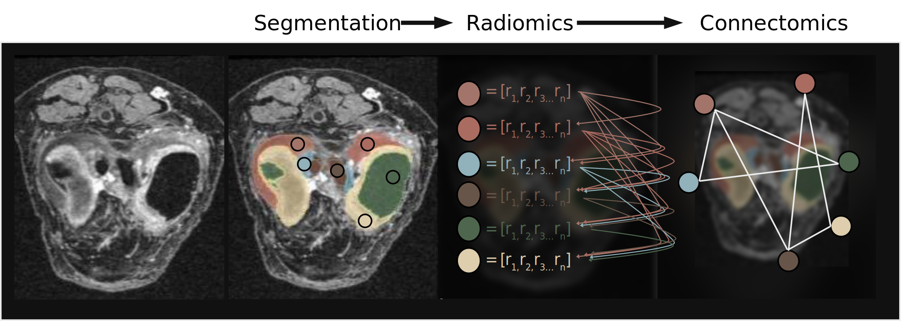

# um2ii-radcon

## A pipeline for radiomics informed connectomics.

---
### Set up
There are two conda enironments needed to run the pipeline:

- um2ii_rad_env: the environment that will be needed to run majority of the pipeline, including any of the inidiviudal scripts. 
- um2ii_pyrad: this environment is exclusivley for pyradiomics and running the radiomics calculations. 

The `radcon.sh` driver script takes care of switching between environment as needed.

---

### Usage
The main driver script is the `radcon.sh` bash script. 

To execute: `radcon.sh [settings].json` See below for explanation of all parameters in the setting JSON file. 

This script will do the following in order

1. Image segmentation using a trained model.
2. For each image, separate out the each segmentation into an individual nifti file.
3. Run the radiomics calculations for each individual segmentation using Pyradiomics, and clean the results
4. Run the connectomics and output individual graph-networks for each image. 
5. Caclulate connectomics metrics and output all radiomics and connectomic calculations in a single csv file. 

Generally speaking, there is a single python script responsible for each of the steps listed above in the `/src/` directory. They can be ran individually if needed. See section below on Script-by-Script documentation. 

Caveats:

- `radcon.sh` makes the image segmentations using a trained nnUNET model and in nifti format. This line of code is emphasized in the bash script and may need to be modifed per use case. 
- This pipeline was built and tested using knee MRIs from the OAI dataset. This loosely affects the naming conventions, so there may be issues with name parsing,...etc. if applying to other datasets. These issues shouldn't be difficult to resolve. The expected name of the input images is: `[pt_id]` _ `[time_point]` _ `[mri_id]` _ `[image_id]` _ `0000.nii.gz` .

Note: Reference the `test_run` folder for example output and the `parameters.json` file for example settings. 

---

### Settings JSON file
|Parameter | Description |
|---|---|
|segmentation_separation |  |
|source_dir | path to raw images in nifti format |
|dest_dir | path where segmentations should be stored |
|segmentation_nifit_seg_path | path where nifti files for each individual segmentation should be stored |
|num_segmentations | the number of segmentations the model predicts|
|  |  |
|radiomics |  |
| dir | directory where all radiomics files are stored |
| thread_count | number of threads to use for |
| | |
|connectomics | |
|dir | directory to store all connectomics files|
|two_tailed_filtering_level | threshold to filter off edge weights for the graphs. (i.e. a value of 15 would mean that only the top and bottom 15% of edge weights will be kept.) |
| | |
|feature_dict | a dictionary that holds the anatomical label for each label id |

---

### Script by script description
|Script | Description |
|---|---|
|read_parameters.py | a script with a utility function to read the parameters JSON file |
| sep_segment_nifti.py| separates the segmented nifti file into individual nifti files for each label|
|make_pyradiomics_input_csvs.py |makes a CSV file to be inputed in to the pyradiomics tool |
|clean_pyrad_results.py | clean the pyradiomics results to include relevant columns and remove n/a values|
|connectomics.py |completes all conneectomics analysis|

